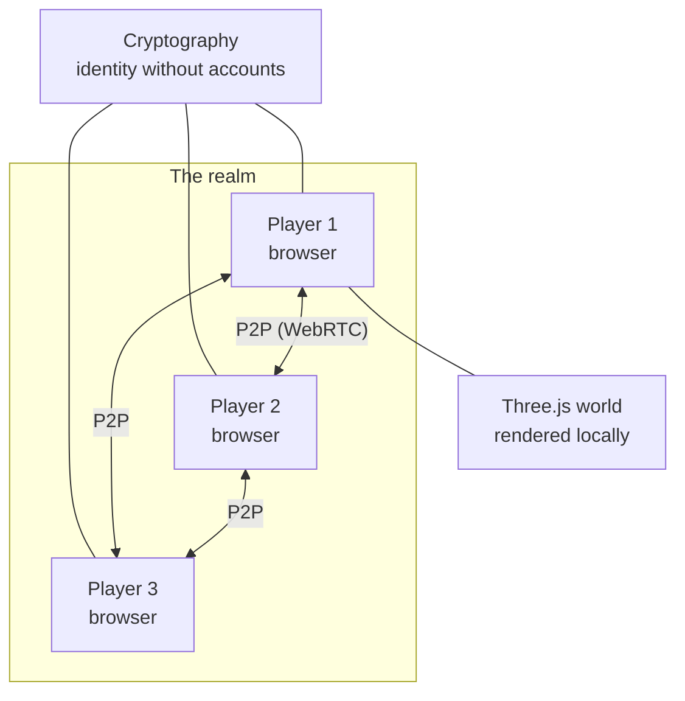

# Spectral Drift

An open-world multiplayer ghost realm that runs entirely in the browser. No servers, no accounts, no downloads — players find each other over a peer-to-peer network and drift through the same shared world, rendered in Three.js.

Most multiplayer games need a fleet of servers before two players can see each other. Spectral Drift is an experiment in the opposite direction: what does a shared world look like when there is no authority at all — when the "server" is simply everyone who happens to be present?

## Architecture



Each browser renders the world locally with Three.js and exchanges position and state directly with its peers. Identity is cryptographic rather than account-based: your keys are your ghost, no email address required. There is no central world state — the realm exists as the overlap of everyone currently haunting it.

## Features

- Open-world exploration in the browser — nothing to install
- Real multiplayer presence over a peer-to-peer network
- No accounts, no server-side state, no tracking
- Atmospheric ghost-realm aesthetic built in Three.js

## Running it

```bash
git clone https://github.com/aryansrao/Spectral-Drift
cd Spectral-Drift
npm install
npm run dev     # Next.js dev server (Turbopack)
```

## Honest limitations

- Peer-to-peer worlds have no referee: a modified client can misbehave, which is acceptable for a ghost realm and unacceptable for a competitive game
- World state is ephemeral — when everyone leaves, the realm forgets
- NAT traversal without TURN means a minority of peers cannot connect directly

## Stack

TypeScript · Next.js / React · Three.js · [Trystero](https://github.com/dmotz/trystero) (serverless WebRTC — peers meet through public WebTorrent trackers) · `@noble/curves` for cryptographic identity

---

Built by [Aryan S Rao](https://github.com/aryansrao). GPL-3.0. Issues and pull requests are welcome.
